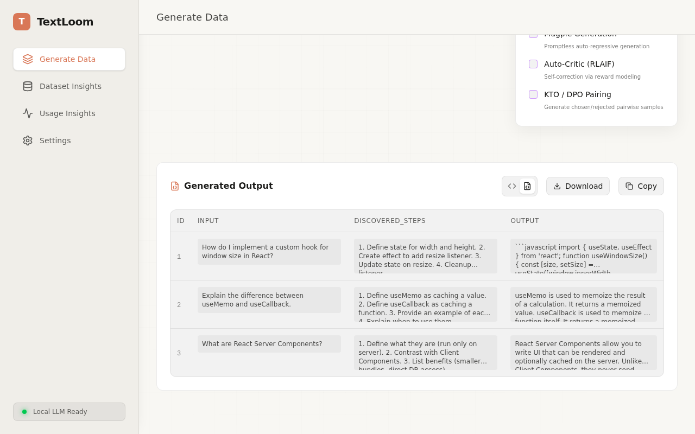

# TextLoom

This is a WebUI for generating high-quality synthetic data using local or API-based LLMs. It solves the complexity of mock data creation by providing an intuitive, ready-to-use interface—no scripting required.

## Key Features

*   **Local & API Support:** Run models locally for privacy or connect to powerful external APIs.
*   **Synthetic Data Generation:** Easily design and instruct models to produce structured, high-quality mock data.

## App Showcase

Here is a visual demonstration of the app:

**Main UI**

**Table View**

